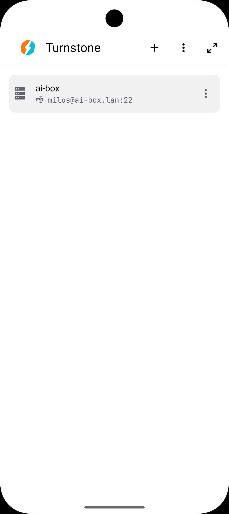
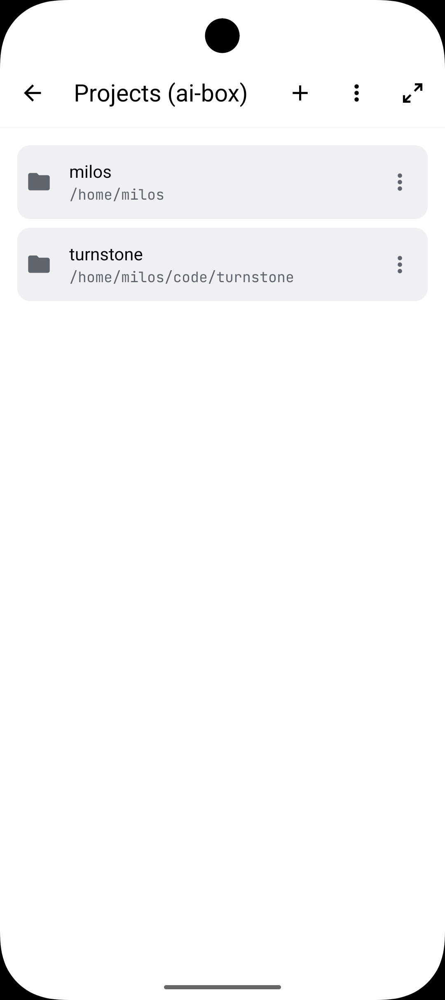
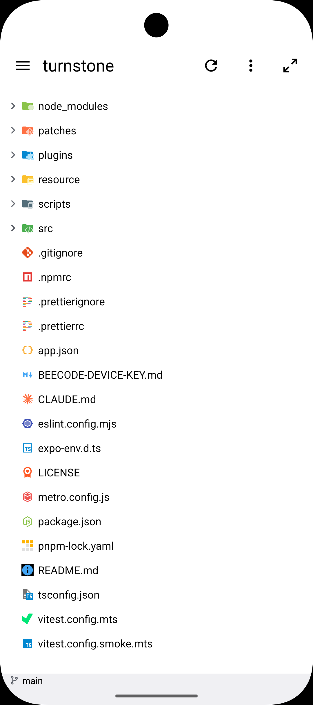
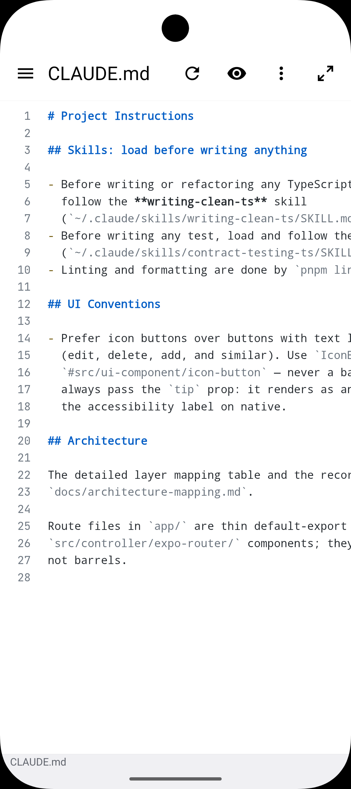
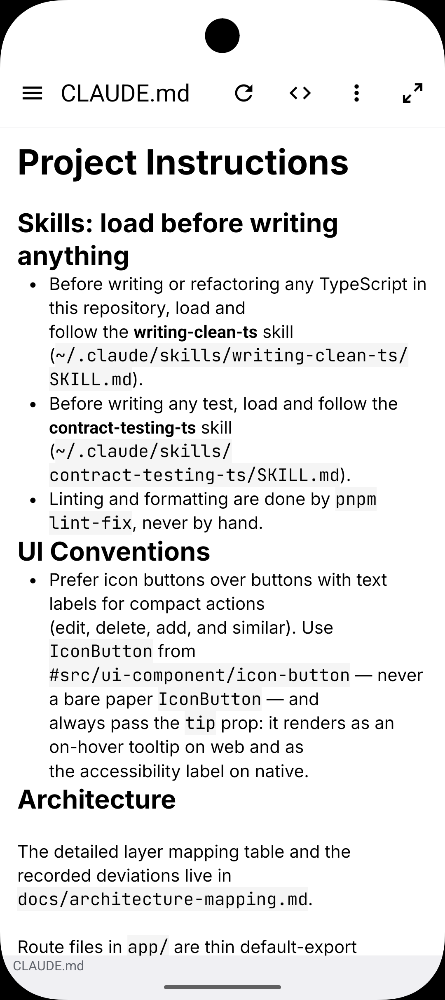
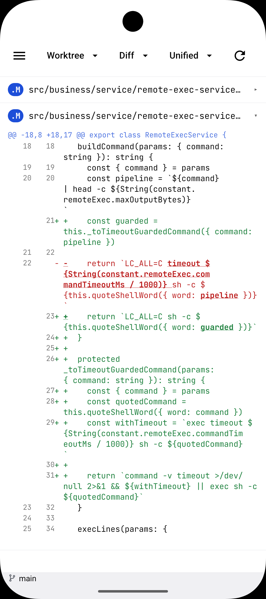
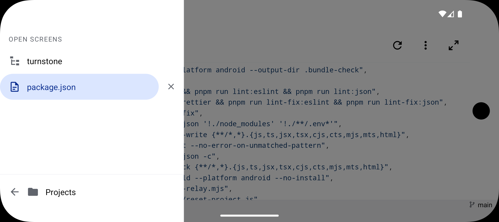
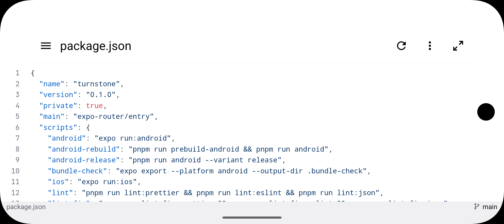
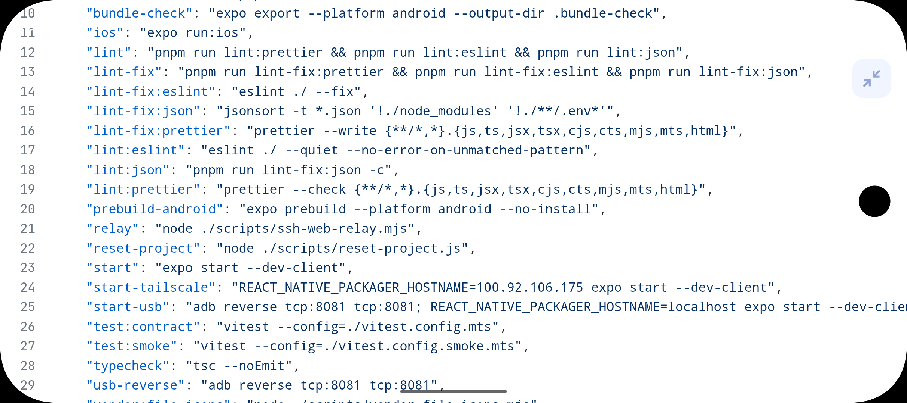

<p align="center">
  
</p>

<h1 align="center">Turnstone</h1>

<p align="center">
  
  
  
  
  
</p>

<p align="center">
  Made by
  <a href="https://beecode.rs"></a>
  <a href="https://beecode.rs"><strong>Beecode</strong></a>
</p>

Turnstone is a small Expo (React Native) app for Android and iOS that browses and reads files on a remote server over SSH. It is strictly read-only. It does six things:

- **Servers** — manage any number of SSH servers with password or ed25519 key auth.
- **Browse** — the remote file tree over SFTP, with file-type icons and filters for dot files and gitignored files.
- **View** — code with syntax highlighting, rendered Markdown and HTML, PDF, and binary file previews.
- **Search** — files on the remote server, gitignored files filtered out.
- **Git** — status and diffs of the remote working tree.
- **Watch** — remote changes reconciled in the tree and open viewers without a manual refresh.

## Status: Proof of Concept

Turnstone is at **v0.1.0** and still a proof of concept. It was built through rapid AI-assisted iteration ("vibe coding") rather than carefully reviewed engineering, so expect rough edges, missing pieces, and breaking changes without notice. While it remains a POC the version stays on `0.x`; the move out of the POC phase coincides with the major version moving to `1`.

## Screenshots

| [Servers](resource/docs/features.md#servers) | [Projects](resource/docs/features.md#browsing) | [File tree](resource/docs/features.md#browsing) |
| :---: | :---: | :---: |
| <a href="resource/screenshots/server-list-screen.png"></a> | <a href="resource/screenshots/project-list-screen.png"></a> | <a href="resource/screenshots/project-tree-view.png"></a> |

| [Markdown source](resource/docs/features.md#viewing-files) | [Rendered Markdown](resource/docs/features.md#viewing-files) | [Git diff](resource/docs/features.md#git) |
| :---: | :---: | :---: |
| <a href="resource/screenshots/markdown-code-view.png"></a> | <a href="resource/screenshots/markdown-rendered-view.png"></a> | <a href="resource/screenshots/git-diff-view.png"></a> |

| [Open screens drawer](resource/docs/features.md#browsing) | [Code viewer, landscape](resource/docs/features.md#theming-and-layout) | [Code viewer, fullscreen](resource/docs/features.md#theming-and-layout) |
| :---: | :---: | :---: |
| <a href="resource/screenshots/side-menu-open-files.png"></a> | <a href="resource/screenshots/code-view-landscape.png"></a> | <a href="resource/screenshots/code-view-fullscreen-landscape.png"></a> |

The titles link to each feature's section in [resource/docs/features.md](resource/docs/features.md).

## Features

- **Servers** — manage any number of SSH servers (label, host, port, username) with password or ed25519 key auth; secrets stay in the device secure store and host keys are verified on first connect.
- **Remote file tree** — browse the server over SFTP with file-type icons, configurable nesting and row density, and toggles to hide dot files and gitignored files.
- **Syntax-highlighted code** — open source files with word-wrap and line-number toggles and tap-to-highlight line selection.
- **Rendered Markdown and HTML** — read Markdown rendered or as source, with task lists, clickable local links, and embedded PlantUML and Mermaid diagrams; HTML switches between rendered and source modes.
- **PDF and binary files** — open PDFs in a viewer and get a preview of binary files.
- **Diagrams** — render PlantUML (`.puml`) and Mermaid (`.mmd`) files as diagrams in the file viewer.
- **Remote search** — find files on the server, with gitignored files filtered out of the results.
- **Git status and diffs** — see status and diffs of the remote working tree, with a branch bar and diff options.
- **Live watching** — watched files and directories reconcile in the tree and open viewers without a manual refresh (inotify where the host supports it, polling as the fallback).
- **Reading comfort** — MD3 light/dark theming plus an e-ink theme, landscape orientation, and file-view margin and font-size settings.

For a deeper look at each feature — settings, edge cases, and how things work under the hood — see [resource/docs/features.md](resource/docs/features.md).

## Feature status

Done:

- [x] Server management (multiple servers, password or key auth, persisted)
- [x] SSH/SFTP connection with TOFU host-key verification
- [x] Remote file tree browsing (file icons, nesting, density, dot-file and gitignore filtering)
- [x] Code viewer with syntax highlighting (word wrap, line numbers)
- [x] Rendered Markdown file view (with source mode)
- [x] HTML viewer with rendered/source modes
- [x] PDF viewer
- [x] Binary file previews
- [x] Remote file search (gitignored files filtered out)
- [x] Git status and diffs
- [x] Remote change watching (inotify with polling fallback)
- [x] MD3 light/dark theming plus an e-ink theme
- [x] Landscape orientation support
- [x] File view margin setting (compact / normal / large; smaller margins give more reading space)
- [x] File view font size setting (xs, s, m, l, xl, xxl; default m)
- [x] Pull to refresh in the file view
- [x] File name in the file view footer
- [x] Server list sorted by name
- [x] Remote folder browser (a folder icon next to the remote path input opens a modal to browse and select a folder)
- [x] Task (checkbox) lists in rendered Markdown
- [x] Tap-to-highlight line selection in the code viewer
- [x] Servers button moved from the drawer to the bottom bar
- [x] Always-open drawer setting (off by default; when on, the tree view hides its drawer-open item)
- [x] Render PlantUML (`.puml`) files as diagrams in the file viewer
- [x] Render Mermaid (`.mmd`) files as diagrams in the file viewer
- [x] Render PlantUML code blocks embedded in Markdown
- [x] Render Mermaid code blocks embedded in Markdown
- [x] View-git-diff button in the file view when the file has git changes
- [x] Selectable text in rendered Markdown
- [x] Clickable local links in rendered Markdown that open the file in the file view
- [x] Cloning a server opens a prepopulated add form to save or cancel, instead of copying the entry

Planned:

- [ ] Biometric lock for the app at startup (fingerprint / face unlock)

## Download & install

Downloads live on the [GitHub Releases](https://github.com/beecode-rs/turnstone/releases) page.

### Android

1. Download the `Turnstone-v<version>-android.apk` asset.
2. Allow installing unknown apps for your browser or file manager (Settings → Apps → Special access → Install unknown apps), then open the APK and confirm the install. Or install over USB: `adb install Turnstone-v<version>-android.apk`.
3. To update, just install a newer APK over the old one — releases are signed with the same key.

### iOS

The `Turnstone-v<version>-ios-unsigned.ipa` asset is **unsigned** (no Apple Developer account is involved), so it gets signed with your own Apple ID at install time by a sideload tool:

- **[AltStore](https://altstore.io)**: add the IPA through AltStore (or AltServer) with your Apple ID.
- **[Sideloadly](https://sideloadly.io)**: drag the IPA in, sign with your Apple ID, install over USB.
- On devices with **TrollStore**, the unsigned IPA can be installed directly and permanently.

Caveats: with a free Apple ID the signature lasts 7 days (re-sideload to refresh) and counts against the 3-active-apps limit. Servers and settings live in the app's own storage, and secrets in the OS secure store.

### From source

Requires [Node.js](https://nodejs.org) and [pnpm](https://pnpm.io).

```bash
git clone https://github.com/beecode-rs/turnstone.git
cd turnstone
pnpm install
pnpm android
```

`pnpm android` builds and installs a dev client on a connected Android device or emulator (it appears as "Turnstone (dev)", so a development build is never confused with a release); `pnpm start` then starts the Metro dev server. The full development setup lives in [resource/docs/development.md](resource/docs/development.md).

## Getting started

1. Open the app and add your first server on the Servers screen — a label, host, port, and username, with a password or an ed25519 key.
2. Connect once and verify the server's host key — it is remembered for future connections.
3. Add the project root you want to browse, typing a remote path or picking the folder with the folder browser.
4. Browse the tree and tap a file — code opens with syntax highlighting and Markdown renders.

## Privacy & security

**Passwords, private keys, passphrases, and accepted host keys** stay on your device, stored in the OS secure store, and are sent only to the server they belong to. The app contains no analytics and no telemetry.

Turnstone only ever reads from your servers — use it with a read-only account; that is what it is built for.

## Support & contributing

Found a bug or have an idea? Open an issue on [GitHub](https://github.com/beecode-rs/turnstone/issues) — include the app version, your OS, and the steps to reproduce. Pull requests are welcome too; keep the [feature status](#feature-status) in mind, and open an issue before starting something large.

## For developers

The README covers using the app. To work on it:

- [Development setup](resource/docs/development.md) — prerequisites, daily commands, quality gates
- [Architecture](resource/docs/architecture.md) — how the source is layered

## License

[MIT](LICENSE)
