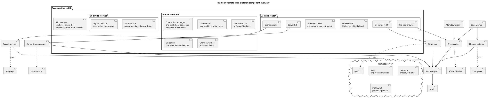

# Investigation: Read-Only Remote Code Explorer over SSH/SFTP (Expo)

App name: **Turnstone** (decision and availability evidence in
[naming.md](naming.md))

Status: complete
Date: 2026-09-10

## 1. Goal

A mobile app built with Expo that connects directly from the phone to one or more
remote servers over SSH and lets the user explore source code read-only: browse the
file tree, search it, open files with syntax highlighting, render markdown, and see
git status/diffs. No file editing. Files that change on the server must refresh on
the client.

## 2. Requirements

### Functional

| #    | Requirement                                                                                                                                                     |
|------|-----------------------------------------------------------------------------------------------------------------------------------------------------------------|
| FR1  | Connect to multiple servers over SSH, with all connection parameters: host, port, username, password auth or private key auth (incl. passphrase-protected keys) |
| FR2  | Keep the SSH session alive for long periods (keep-alive, auto-reconnect)                                                                                        |
| FR3  | Browse the remote file tree                                                                                                                                     |
| FR4  | Search the file tree (by name and/or content) use fuzzy search                                                                                                  |
| FR5  | Open any code file full-screen with syntax coloring per file type                                                                                               |
| FR6  | View markdown files both rendered and as raw source (toggle)                                                                                                    |
| FR7  | If the remote directory is a git repo: list changed files and view per-file diffs                                                                               |
| FR8  | Dark and light theme                                                                                                                                            |
| FR9  | Strictly read-only: no writes, no file editing                                                                                                                  |
| FR10 | When a file changes on the remote server, the client refreshes it                                                                                               |

### Non-functional and constraints

- Expo-based app (user constraint). Expo Go compatibility is nice-to-have; a development build (`expo prebuild` / EAS) is acceptable if native modules are required.
- Direct phone-to-server connection; no intermediate relay/self-hosted gateway (that would change the product into something else; called out as an alternative only if direct SSH proves infeasible).
- Credentials and private keys stored on device must be encrypted at rest (platform keystore/keychain).
- Performance targets: tree navigation feels instant (lazy loading), files up to a few hundred KB render smoothly, files up to ~1-2 MB render with degraded mode (no highlighting or partial render).
- Platform: Android + iOS.

## 3. Key unknowns to resolve

1. Which SSH client library actually works in React Native/Expo today (this is the highest-risk area; RN has no raw TCP socket by default).
2. Which syntax highlighting approach survives mobile performance and theming needs.
3. How to detect remote file changes without installing anything on the server.
4. How well git porcelain/diff output can be parsed client-side for the git view.

## 4. Platform constraints (Expo)

React Native's JS runtime (Hermes) has no `net` module and no raw TCP socket,
and Expo Go ships no TCP capability (verified against Expo SDK 57 docs and the
React Native Directory; no first-party `expo-tcp`/`expo-ssh` package exists).
Direct phone-to-server SSH therefore always requires native code.

**Consequence: Expo Go is out for every SSH option. The app needs an Expo
development build (**`expo prebuild` **/ EAS Build) in all cases.** This is
acceptable per the constraints in section 2, but it shapes the budget: we are
already paying the dev-build cost, so adding further native modules (quick-crypto,
SQLite, MMKV) costs nothing extra in workflow terms.

iOS background reality (applies to every option): iOS suspends sockets when the
app goes to background, so "long-lived session" in practice means SSH keepalives
while foregrounded plus reliable reconnect-on-wake. See section 6.

## 5. SSH connectivity (FR1)

### 5.1 Options evaluated

| Option                                                                                         | Engine                                                              | Last release                                       | Maintained                                           | Platforms                                                                                   | Expo           | Host key verification                                   | License  |
|------------------------------------------------------------------------------------------------|---------------------------------------------------------------------|----------------------------------------------------|------------------------------------------------------|---------------------------------------------------------------------------------------------|----------------|---------------------------------------------------------|----------|
| **react-native-russh**                                                                         | russh (Rust, by the Tabby author) via uniffi                        | 0.1.0, 2026-08-21 (repo active, pushed 2026-09-10) | Yes (extracted from the open-source Whip SSH client) | Android 7+/ARM64, iOS 16.4+/ARM64; no x86 emulators / Intel sims; New Architecture required | dev build      | Yes, strict OpenSSH known_hosts incl. hashed hostnames  | AGPL-3.0 |
| **ssh2 (JS) + react-native-tcp-socket + react-native-quick-crypto**                            | pure JS ssh2 1.17.0 (2025-08-20) over tcp-socket 6.4.3 (2026-09-10) | both active                                        | Yes                                                  | Android + iOS                                                                               | dev build      | Via `hostVerifier` callback (TOFU implemented app-side) | MIT      |
| @dylankenneally/react-native-ssh-sftp                                                          | iOS: NMSSH/libssh2, Android: JSch (mwiede)                          | 1.11.0, 2026-07-04                                 | Yes                                                  | iOS + Android (no iOS simulator)                                                            | dev build      | **None; README carries an explicit MITM warning**       | MIT      |
| nodejs-mobile-react-native                                                                     | embedded Node 18 runtime                                            | 18.20.4, 2024-10; repo dormant                     | No (open Expo SDK 53/Gradle breakage, Node 18 EOL)   | iOS + Android                                                                               | bare/dev build | whatever ssh2 gives                                     | MIT      |
| azlyth/react-native-ssh, shaqian/react-native-ssh-sftp, @marcomueglich/react-native-ssh-client | libssh2/JSch                                                        | 2016-2018 / 2026-01                                | No (abandoned/experimental)                          | partial                                                                                     | dev build      | n/a                                                     | various  |

Details:

- **react-native-russh** (https://github.com/KaminariOS/whip): password auth; Ed25519/RSA/ECDSA keys with optional passphrase; strict known_hosts verification (`setKnownHosts('<OpenSSH line>')`, structured reject on unknown/changed key, hashed hostnames supported, fingerprint inspection for a TOFU flow); exec + PTY shell + full SFTP on one connection; agent forwarding; a ranged-read SFTP loopback file server (interesting for the code viewer); Android network-change listener (helps reconnect-on-network-switch). Caveats: first release (0.1.0), AGPL-3.0, ARM64-only, no keepalive/timeout knobs exposed in the public API (rely on reconnect-on-error).
- **ssh2 in Hermes**: proven pattern in the wild (https://github.com/xeptor6569/xt-ssh-client, an Expo SDK 54 app): `ssh2` + `react-native-tcp-socket` + `react-native-quick-crypto` + `buffer`/`stream-browserify`/`events`/`process` polyfills + stub modules for `net`/`fs`/`zlib`/etc. wired through Metro `extraNodeModules`. ssh2's full API then works: `password`, `privateKey` + `passphrase` (OpenSSH format, ed25519 supported), `hostVerifier` (default is auto-accept if unset, so we must implement TOFU), `keepaliveInterval` / `keepaliveCountMax`, `readyTimeout`, compression. Cost: we own the polyfill stack against a moving Expo/Metro target; budget a hardening week and pin versions.
- Precedents: Blink Shell (iOS, Swift over libssh2/libssh/OpenSSH frameworks) and WebSSH (embedded OpenSSH port) are native; Whip (RN + russh) is the proof that the RN + Rust path ships in a real mobile app. No mature open-source RN SFTP file browser exists to copy from.

### 5.2 Feature mapping to requirements

| Requirement                                | react-native-russh         | ssh2 combo                         | dylankenneally    |
|--------------------------------------------|----------------------------|------------------------------------|-------------------|
| Password auth                              | yes                        | yes                                | yes               |
| Key auth + passphrase (ed25519/RSA/ECDSA)  | yes                        | yes (OpenSSH key format)           | yes               |
| Host key verification (TOFU + known_hosts) | built-in, strict           | app-side via hostVerifier          | **none**          |
| Keep-alive knobs                           | not exposed                | keepaliveInterval/CountMax         | not exposed       |
| Concurrent SFTP + exec channels            | yes                        | yes (many channels)                | yes               |
| Range/partial file reads                   | yes (SFTP loopback server) | yes (SFTP read with offset/length) | download-oriented |
| License risk                               | AGPL-3.0                   | MIT                                | MIT               |

### 5.3 Recommendation

- **Primary: ssh2 over react-native-tcp-socket** (MIT, full protocol control: keepalive, hostVerifier TOFU, compression, timeouts, mature protocol logic), accepting that we maintain the polyfill stack. MIT matters if this ever ships publicly; keepalive knobs are required by FR2; `sock:` injection is documented in ssh2 itself.
- **Watch closely: react-native-russh**, the better-engineered native path (memory-safe Rust, strict host-key verification by default). Blocked today by AGPL-3.0 + 0.1.0 maturity + ARM64/New-Arch-only coverage + missing keepalive knobs. Re-evaluate if it matures; its API surface otherwise fits this app exactly.
- **Rejected**: dylankenneally (no host key verification is close to disqualifying for an app SSHing into multiple servers, possibly over untrusted networks), nodejs-mobile (dormant, Node 18 EOL), pre-2024 wrappers.

### 5.4 Credential storage (FR1, security)

- `expo-secure-store`: iOS Keychain (`keychainAccessible` incl. `WHEN_UNLOCKED`, optional biometric gating), Android SharedPreferences encrypted with an Android Keystore key. Works in dev builds.
- Model after Blink: non-secret host configs (host, port, user, key prefs) in normal storage; secrets (passwords, private keys, passphrases) only in SecureStore; one known_hosts entry per host alongside configs.
- Gotchas from the Expo docs: iOS keychain survives reinstall for the same bundle ID; Android data does not survive uninstall and must be excluded from Android Auto Backup; values historically limited to ~2 KB on some iOS releases, so store key material as separate entries.

## 6. Session keep-alive (FR2)

- ssh2: set `keepaliveInterval: 15000` and `keepaliveCountMax: 3` (mirrors OpenSSH ServerAliveInterval/CountMax semantics). This keeps NAT mappings warm and detects dead peers within ~45 s.
- Reconnect is app-level in every option: listen for `close`/`error`, re-run connect with backoff, then reconcile visible state (section 13).
- iOS suspends sockets in background: pause keepalives on `AppState` change to background, and on foreground treat the connection as suspect (cheap probe exec or keepalive; reconnect if dead). Blink solves roaming with Mosh (UDP), which is out of scope for an SFTP-based explorer.
- Multiple servers (FR1): one ssh2 Client per server, held in a connection manager keyed by host id; connect lazily on first use; disconnect on app-close or after long idle (configurable).

## 7. File tree browsing (FR3)

**Design: lazy SFTP READDIR expansion, client-side sort, persisted cache.**

- SFTP v3 READDIR returns full attrs (size, mtime, permissions) per entry, so one OPEN + k READDIR + CLOSE lists a directory with zero per-entry stat round trips and no `ls -la` parsing (locale-dependent, BSD vs GNU layouts). Dotfiles are returned unconditionally. Requests pipeline over one SFTP session, so a 1,000-entry directory is a few RTTs.
- Sort client-side (directories first, case-insensitive natural sort); server order is arbitrary.
- Lazy-expand on tap only. Huge directories: append each READDIR batch to the list as it arrives; render first ~200 rows and page from the in-memory array. Auto-collapse single-child directory chains for deep paths.
- Bulk snapshot alternative (one round trip, for cache warm): `LC_ALL=C find <dir> -type d \( -name .git -o -name node_modules -o -name target -o -name dist \) -prune -o -printf '%y\t%s\t%T@\t%p\n'`, capped with `head -c 2M`.
- **Git repo detection** (FR7 prerequisite): hybrid. SFTP lstat `<dir>/.git` (existence, not is-dir: worktrees/submodules have `.git` as a file; memoize negatives per parent) + once per unknown root `git rev-parse --show-toplevel && --git-dir` over exec (handles worktrees and entering from subdirs).
- **Cache between sessions**: persist per host+path children (name, type, size, mtime) plus UI state in expo-sqlite or MMKV. POSIX guarantee: a directory's own mtime only changes when a direct child is added/removed/renamed, so unchanged dir mtime means the cached child list is still valid. Paint from cache instantly, stat the dir, re-readdir + diff only if mtime changed.

## 8. File search (FR4)

**Design: capability-tiered search over exec, streamed line-delimited, rendered
in batches.** Never traverse via SFTP for search (2-3 RTTs per directory makes
it minutes on a 500-dir tree; no content matching either).

Probe once per host on connect (single round trip): `command -v rg; command -v inotifywait; git --version; uname -s`. Cache per host.

- Tier 1, ripgrep (verified against rg 14.1.1): `LC_ALL=C rg --json --smart-case --max-count 50 --max-filesize 2M -g '!.git' --hidden -- 'PATTERN' <root>`. `--json` emits line-delimited events (begin/match/end/ summary) with submatch ranges, i.e. highlight spans for free; respects .gitignore, skips binaries, parallel. Filename search: `rg --files <root> | rg -i 'pattern'`.
- Tier 2, GNU grep: `LC_ALL=C grep -rn -I -E --color=never --exclude-dir=.git --exclude-dir=node_modules --exclude-dir=dist -- 'PATTERN' <root> 2>/dev/null`. `-I` skips binaries; stderr redirect swallows the permission-error flood; repeat `--exclude-dir` per dir (brace lists are not expanded inside grep's own glob).
- Tier 3, BusyBox/POSIX (no `-I`, no `--exclude-dir`): find with prune + `grep -n -H -- PATTERN /dev/null {} +`.
- Streaming: read stdout as chunks, split on `0x0A`, buffer partial trailing lines; `0x0A` never occurs inside a UTF-8 multibyte sequence, so newline-splitting before decode is always safe. Append results in batches of ~50 per frame. Bound server-side with `timeout 15` and `| head -c 1M`; cancel by closing the channel. Cap display at ~1,000 matches.
- Always single-quote/`printf %q` user patterns server-side; prefix commands with `LC_ALL=C`.

## 9. Reading files (FR5/FR6 input path)

- **Range reads**: SFTP open + `read(handle, offset, length)`. Fetch first 64-128 KB for instant display; load further 128 KB chunks on scroll; show size upfront (from tree attrs) with an explicit load affordance past ~1 MB.
- **Binary sniff**: first 8 KB contains `0x00` -> binary (same heuristic as git and ripgrep). BOM checks for UTF-8/UTF-16. Binary path renders a placeholder (+ hex preview of first page if wanted).
- **Encoding**: UTF-8 default, latin-1 lossless fallback. Hermes may lack TextDecoder: prefer `text-encoding-polyfill` (WHATWG impl, streaming-safe); `fast-text-encoding` has no `{stream:true}` support and corrupts multibyte chars at chunk boundaries. Or decode only complete lines (newline-split rule above makes this safe).
- **Render limits**: virtualize lines (FlatList windows of ~200 lines); never hand a 5 MB string to one `<Text>`. Initial render <= 256 KB, on-demand full load <= ~2 MB, chunked scrolling beyond. Tokenize only visible windows (see section 10).
- **Language mapping**: embedded extension map modeled on github/linguist `languages.yml` (filename exact match, then shebang from first 256 bytes, then extension). A few hundred entries cover ~99% of code files.

## 10. Code viewer and syntax highlighting (FR5)

**Finding: there is no maintained off-the-shelf native RN code viewer that
meets the bar.** Options evaluated (all facts verified from npm/GitHub, 2026-09-10):

| Option                                                                                                                                                                  | Status                                                                                                                                                                               | Verdict                                                                                                                                                                                                                                                                                                                 |
|-------------------------------------------------------------------------------------------------------------------------------------------------------------------------|--------------------------------------------------------------------------------------------------------------------------------------------------------------------------------------|-------------------------------------------------------------------------------------------------------------------------------------------------------------------------------------------------------------------------------------------------------------------------------------------------------------------------|
| react-syntax-highlighter + react-native-syntax-highlighter wrapper                                                                                                      | wrapper last released 2019, unmaintained; RN path has no line numbers (listed under "unsupported props"); full re-highlight on every re-render (issue #302)                          | Rejected for the main viewer: tens of thousands of `Text` nodes for large files is infeasible; fine only for small inline snippets                                                                                                                                                                                      |
| WebView viewer: react-native-webview 16.0 (2026-07, fabric-only, works in Expo Go and dev builds) + bundled local HTML + highlight.js or Shiki                          | maintained, ~2.6M dl/wk                                                                                                                                                              | Strong: line numbers via CSS gutter, synced horizontal scroll, native selection/copy, dark/light = CSS class swap, bundled monospace webfont, full offline operation. Shiki runs inside the WebView even though WASM cannot run in Hermes. Cons: WebView warm-up, chunked injection for big files, nested-scroll config |
| react-native-shiki-engine 0.3.12 (2026-06, active): JSI C++ TurboModule with vendored native Oniguruma, synchronous, thread-safe; Shiki tokens rendered by our own view | maintained, New Arch + dev build required                                                                                                                                            | Highest quality: VS Code-grade grammars/themes natively; requires building a custom windowed renderer (FlatList of fixed-height line-chunk rows in one horizontal ScrollView + fixed gutter column)                                                                                                                     |
| Shiki/others directly in Hermes                                                                                                                                         | WASM in Hermes is not a documented production path (tracking issue facebook/hermes#429 still open; RN 0.84 blog makes no mention); Shiki's JS-regex engine in Hermes is undocumented | Do not depend on either                                                                                                                                                                                                                                                                                                 |

**Recommendation: two-phase.**

1. **Phase 1 (build first): WebView + highlight.js (or Shiki) from a bundled local HTML asset.** It is the only option that delivers every FR5 sub-need (full screen, per-type coloring, line numbers, horizontal scroll, selection, both themes) with days of work, and large-file windowing is implementable by injecting line-range chunks and highlighting only visible windows.
2. **Phase 2 (optional upgrade): react-native-shiki-engine + custom windowed native renderer**, if the WebView feel or performance becomes the bottleneck. The viewer is the product, so this upgrade path is worth keeping open; design the viewer screen behind a narrow interface from day one so the rendering engine is swappable.

Since SSH already forces a dev build (section 4), Expo Go compatibility is not
a selection criterion here.

## 11. Markdown rendered + source (FR6)

| Library                                                | Latest                                       | Status                    | GFM                                      | Highlighted fenced code                                                | Notes                                                                                                                                                                                                                |
|--------------------------------------------------------|----------------------------------------------|---------------------------|------------------------------------------|------------------------------------------------------------------------|----------------------------------------------------------------------------------------------------------------------------------------------------------------------------------------------------------------------|
| react-native-enriched-markdown (Software Mansion Labs) | 1.0.2, 2026-08-20, nightlies through 2026-09 | new flagship, very active | full (tables, task lists, strikethrough) | yes, native tree-sitter, configurable language set                     | native rendering (no WebView), selection/copy, `onCodeBlockPress(code, language)` callback explicitly designed for handing code off to a viewer; New Arch + dev build required; postinstall downloads grammar assets |
| @ronradtke/react-native-markdown-display               | 9.0.3, 2026-06-29                            | maintained                | markdown-it (tables, typographer)        | yes, prism-react-renderer, `oneLight`/`oneDark` via `colorScheme` prop | pure JS, zero native code                                                                                                                                                                                            |
| react-native-marked                                    | 8.3.0, 2026-09-10                            | very active               | marked.js                                | no (monospace styling only)                                            | solid fallback                                                                                                                                                                                                       |
| react-native-markdown-display (iamacup)                | 7.0.2, 2023-12                               | maintenance mode          | CommonMark, tables partial               | no                                                                     | README itself recommends migrating away                                                                                                                                                                              |

**Recommendation: react-native-enriched-markdown.** The dev build is already
required, it is the strongest renderer, and `onCodeBlockPress` maps directly
onto our code viewer screen (tap a fenced block -> open it full screen in the
viewer). Fallback: @ronradtke fork.

**Source view toggle is trivial with any option**: render the same file
through the code viewer with language `markdown`. One screen, two modes.

## 12. Git integration (FR7)

All commands verified against git 2.x; run over exec from the detected repo
root (section 7).

**Status (branch + ahead/behind + changed files in one command):**

```
git --no-optional-locks -c core.quotePath=false -c color.ui=never \
  status --porcelain=v2 --branch
```

- `--porcelain=v2 --branch` emits `# branch.head`, `# branch.ab +N -N`, `# branch.oid`, then one line per change: `1 .M N... ... path` (ordinary), `2 R. ... new<TAB>orig` (rename/copy with similarity), `? untracked`, `!` ignored. Rename detection is on by default since git 2.9; pass `-M` explicitly on diff commands anyway.
- `--no-optional-locks` stops status from writing the refreshed index (the official recommendation for background tools; avoids lock contention with the user's own git commands on the server).
- `-c core.quotePath=false` is important: default config octal-escapes non-ASCII paths (`"\321\204..."`); the flag returns raw UTF-8.
- Floor: git >= 2.11 (Nov 2016); fallback to `--porcelain=v1 -b` for older (probe `git version` once per host).

**Diffs:**

- Semantics: `git diff` (worktree vs index), `--cached` (index vs HEAD), `HEAD` (both), always with `--no-color --no-ext-diff --no-textconv` (`.gitattributes` diff drivers can otherwise replace the unified output entirely).
- File list first: `git diff --numstat -z [-M] [HEAD|--cached]` (NUL-delimited `added\tdeleted\tpath`, `- -` for binaries) or `--name-status -M` (`M path`, `R100 new orig`). Lazy-load the full patch per file only when its row expands: `git diff -M --no-color --no-ext-diff --no-textconv -U3 -- <path>`.
- Word-level refinement for the mobile UI: plain unified diff + jsdiff `diffWords` computed client-side on changed line pairs (nicer typography, no server dependency), rather than `--word-diff` output parsing.

**Other:** branch/last-commit via `git log -1 --format='%H%n%h%n%an <%ae>%n%at%n%cr%n%s'`;
repo root once via `git rev-parse --show-toplevel`; `-uno` to skip untracked
on huge repos.

**Client-side parsing libraries** (RN compatibility verified by inspecting
tarballs for Node built-ins; registry data 2026-09-10):

| Package                | Status                                   | Role                                                                         |
|------------------------|------------------------------------------|------------------------------------------------------------------------------|
| parse-diff 0.12.0      | maintained (2026-04)                     | unified diff parser, zero deps; primary choice                               |
| diff (jsdiff) 9.0.0    | maintained (2026-04), 532M dl/mo         | word/line diff computation client-side                                       |
| gitdiff-parser 0.3.1   | dormant since 2023 but pure string logic | richest typed API (File/Hunk/Change, isBinary, rename); low-risk alternative |
| parse-git-status 0.1.0 | abandoned (2016)                         | do not adopt; porcelain v2 parsing is ~30 lines, hand-roll it                |

## 13. Remote change detection and refresh (FR10)

Precedent check: VS Code Remote-SSH installs a server component for real file
events (forbidden here); SSHFS, the canonical agentless SFTP client, is pure
polling with ~20 s attr caches. Honest baseline = polling; events where
available.

**Layered hybrid (all read-only, nothing installed on servers):**

1. **Open file polling**: SFTP stat (mtime, size) on the file in the viewer every 3-5 s, only while the viewer is focused and the app foregrounded (AppState gate). On delta: re-read affected range, re-render, preserve scroll anchor by line.
2. **Visible tree polling**: every 15-30 s, stat the expanded directories (all stats pipelined, ~1 RTT). Dir mtime unchanged -> skip (POSIX: only direct child add/remove/rename bumps it); changed -> re-readdir that dir and reconcile rows with animation.
3. **Opportunistic inotify acceleration**: if the connect probe found `inotifywait` (inotify-tools is actively maintained: 4.25.9, Sep 2024), run one long-lived exec channel: `LC_ALL=C inotifywait -m -q -e close_write,create,delete,move,moved_to,moved_from --format '%e\t%w%f' <expanded-dirs...>` watching only currently expanded dirs (non-recursive, avoids `max_user_watches` exhaustion). Parse the event stream line by line; reconcile instantly. On channel death (idle timeout, network drop) fall back to layer 2 and retry the watcher with backoff. `close_write` (not `modify`) is the useful "file settled" event for a reader.
4. **Manual + lifecycle**: pull-to-refresh everywhere; full visible-state reconciliation on app foreground and on SSH reconnect.
5. macOS servers: fswatch is rare; polling covers them.

Stop all polling when the connection drops; keepalives (section 6) keep NATs
from killing the session between polls.

## 14. Theming: dark + light (FR8)

Standard, low-risk, no exotic dependencies needed:

- `useColorScheme()` from RN core for the system scheme (`react-native-appearance` is dead; folded into core in 2020).
- React Navigation 7 theming (`DefaultTheme`/`DarkTheme`) via expo-router's `ThemeProvider`; `useTheme()` inside screens.
- Persisted override: store `"system" | "light" | "dark"` in AsyncStorage (not sensitive, so SecureStore is unnecessary); resolve the effective scheme in a small context that wraps `ThemeProvider`.
- `expo-system-ui` to keep the root view background correct; `expo-font` to bundle one monospace font (e.g. JetBrains Mono) so code metrics and gutter alignment are identical on iOS and Android.
- Viewer themes must follow the app theme: WebView path swaps a CSS class (highlight.js/Shiki theme pair); shiki-engine path loads the matching Shiki theme per direction.

## 15. Recommended architecture



Design notes:

- The SSH transport sits behind one narrow port (connect, exec, sftp read, readdir, stat, subscribe-to-close) so the ssh2 implementation can be swapped for react-native-russh later without touching services or UI.
- One ssh2 `Client` per server, held by the connection manager; SFTP session opened once and reused (requests pipeline); exec channels opened per command and closed after.
- All remote commands share one executor helper that injects `LC_ALL=C`, quoting, timeouts, and output caps; capability probe results are cached per host.

## 16. Risks and open questions

### Risks

| #  | Risk                                                                                                                                                  | Severity          | Mitigation                                                                                                                |
|----|-------------------------------------------------------------------------------------------------------------------------------------------------------|-------------------|---------------------------------------------------------------------------------------------------------------------------|
| R1 | ssh2-on-Hermes polyfill stack breaks on Expo/Metro upgrades (we own it; the known working pattern is a small personal repo, not a maintained library) | high              | spike it first (see build order); pin versions; isolate behind the SSH transport port; react-native-russh is the fallback |
| R2 | ssh2 defaults to auto-accepting host keys if `hostVerifier` is not set                                                                                | security-critical | implement TOFU on first connect (show fingerprint, store in SecureStore, compare afterwards); reject mismatches loudly    |
| R3 | iOS suspends sockets in background: sessions cannot literally stay alive indefinitely                                                                 | medium            | expectation: keepalive + reconnect-on-wake + visible-state reconciliation; Mosh-style UDP roaming explicitly out of scope |
| R4 | `inotifywait` absent on minimal servers (common on Debian/Ubuntu minimal images)                                                                      | low               | polling is the universal core; inotify is only acceleration                                                               |
| R5 | Hermes may lack TextDecoder (status in Hermes V1 unverified)                                                                                          | low               | newline-safe decoding or `text-encoding-polyfill` (not `fast-text-encoding`: no streaming support)                        |
| R6 | `git status` takes seconds on monorepos                                                                                                               | low               | refresh on demand only, `-uno`, `--no-optional-locks`, name-list first with lazy per-file diffs                           |
| R7 | Non-UTF8 filenames/content on old servers                                                                                                             | low               | `LC_ALL=C` + lossy byte-to-string display, never crash                                                                    |
| R8 | Large files degrade rendering                                                                                                                         | medium            | windowed virtualization everywhere, 256 KB initial / ~2 MB on-demand caps, tokenize visible windows only                  |
| R9 | If russh is chosen instead: AGPL-3.0, v0.1.0 maturity, ARM64-only, no keepalive knobs                                                                 | contextual        | only relevant if ssh2 path fails; fine for a personal/internal app, contaminating for a shipped proprietary app           |

### Open questions

1. Distribution: personal/internal only, or app stores? (Decides whether russh's AGPL-3.0 is acceptable as a fallback and whether store review constraints matter. The recommended ssh2 stack is all MIT.)
2. Target devices: physical ARM64 phones only, or is emulator/x86 support needed during development? (Only constrains the russh fallback.)
3. Server fleet: Linux-only or also macOS? (macOS loses inotify acceleration; polling covers it. Git >= 2.11 floor for porcelain v2, with v1 fallback.)
4. Any servers using keyboard-interactive/2FA auth rather than plain password? (Out of scope for v1 unless required.)

## 17. Verdict

**Feasible. All ten requirements are achievable** with a dev-build Expo app;
only FR2 needs an expectation adjustment (foreground keepalive plus
reconnect-on-wake, not literally immortal background sessions, on iOS).

### Recommended stack

| Layer          | Choice                                                                                                                                               | Why                                                                                                                                   |
|----------------|------------------------------------------------------------------------------------------------------------------------------------------------------|---------------------------------------------------------------------------------------------------------------------------------------|
| Runtime        | Expo SDK 57, development build, expo-router, New Architecture                                                                                        | direct SSH needs native modules; SDK 57 defaults align with every chosen library                                                      |
| SSH            | ssh2 + react-native-tcp-socket + react-native-quick-crypto + node polyfills (all MIT)                                                                | full protocol control: keepalive, hostVerifier TOFU, compression, timeouts; proven pattern exists; react-native-russh is the fallback |
| Credentials    | expo-secure-store                                                                                                                                    | Keychain/Keystore at rest; host configs non-secret, secrets only in SecureStore                                                       |
| Tree           | lazy SFTP readdir + client sort + SQLite/MMKV cache keyed on dir mtime                                                                               | few RTTs per directory; instant cache paint                                                                                           |
| Search         | exec tiers: ripgrep `--json`, then grep, then find+grep; streamed lines, capped                                                                      | works on any server, best where rg exists                                                                                             |
| Code viewer    | Phase 1: WebView + highlight.js/Shiki from bundled HTML; Phase 2 optional: react-native-shiki-engine + custom windowed renderer                      | only approach meeting all viewer needs quickly; native upgrade path preserved                                                         |
| Markdown       | react-native-enriched-markdown (`onCodeBlockPress` -> viewer); fallback @ronradtke fork                                                              | best renderer; dev build already required anyway; source toggle = viewer with language markdown                                       |
| Git            | exec: `status --porcelain=v2 --branch` + `diff -M --no-ext-diff --no-textconv`; parse-diff + jsdiff                                                  | one command for branch + changes; verified formats; maintained parsers                                                                |
| Change refresh | poll stat (3-5 s open file, 15-30 s visible dirs) + opportunistic inotifywait on expanded dirs + pull-to-refresh + reconcile on foreground/reconnect | honest agentless baseline, accelerated where possible                                                                                 |
| Theming        | useColorScheme + React Navigation 7 themes via expo-router; persisted override in AsyncStorage; bundled mono font                                    | standard, low risk                                                                                                                    |

### Suggested build order (de-risk first)

1. **Spike (do before anything else)**: dev build with ssh2 + tcp-socket + quick-crypto + polyfills; connect with password and with a passphrase key; run one exec command and one SFTP range read. This is the only unknown that could kill the whole approach; 1-2 days.
2. Server list + connection manager + SecureStore + TOFU host key flow.
3. File tree browse + cache.
4. Code viewer (WebView phase).
5. Markdown view + source toggle.
6. Search.
7. Git status + diffs.
8. Change watching (polling first, inotify second).
9. Theme polish (basic dual theme from day 1; polish last).